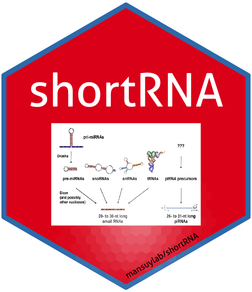

<!-- START doctoc generated TOC please keep comment here to allow auto update -->
<!-- DON'T EDIT THIS SECTION, INSTEAD RE-RUN doctoc TO UPDATE -->

- [short RNA project](#short-rna-project)

<!-- END doctoc generated TOC please keep comment here to allow auto update -->

# short RNA project
This is a project for the development of short RNA analysis R package. It was initiated by Pierre-Luc in 2017.
