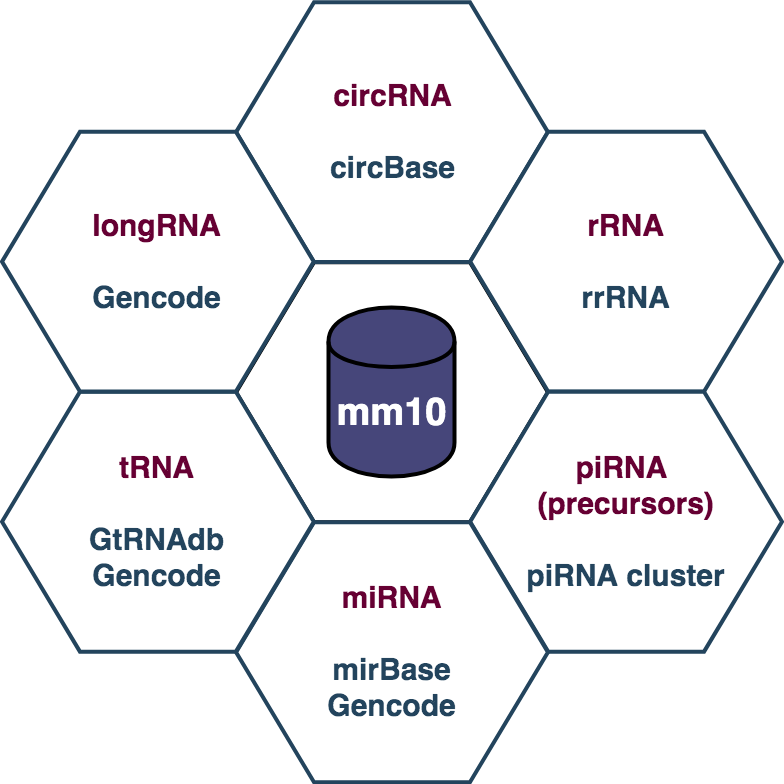
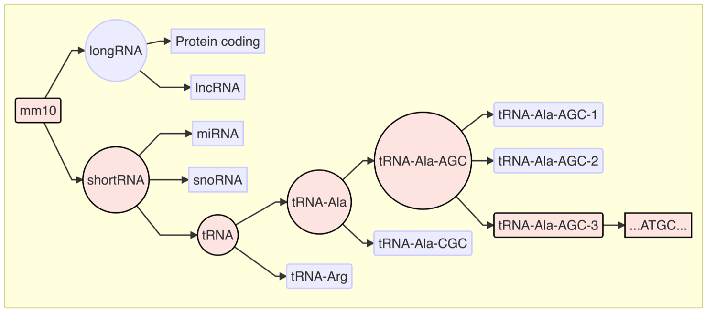
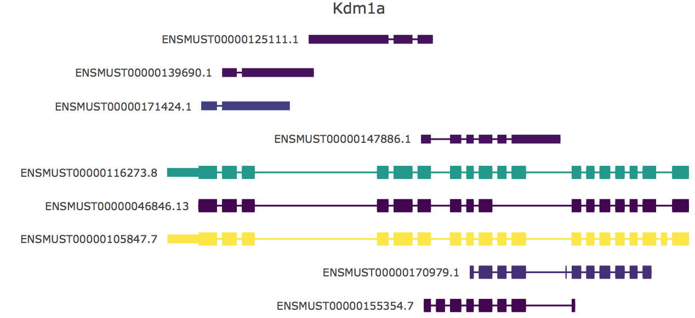

---
#--Poster dimension--#
poster_height: "46.8in"
poster_width: "33in"

#--Title--#
title: "shortRNA: A flexible framework for the analysis of short RNA sequencing data applicable to studies on epigenetic inheritance"
titletext_fontfamily: "Arial"
title_textsize: "80pt"
titlebox_bgcol: "#008080"
titlebox_bordercol: '#0b4545'
titlebox_borderwidth:	"1cm"
title_textcol: "#ffffff"
logoleft_name: "files/ethz.png"
logoright_name: "files/baseplot.png"

#--Authors--#
author:
  - name: Pierre-Luc Germain<sup>†</sup>
    affil: 1,2,3,4
  - name: <u>Deepak K. Tanwar</u><sup>†</sup>
    affil: 1,2,3
  - name: Isabelle M. Mansuy
    affil: 1,2
author_textsize: "60pt"
author_textcol: "#0b4545"

#--Affiliations--#
affiliation:
  - num: 1
    address: "Institute for Neuroscience, Department of Health Sciences and Technology, ETH Zürich"
  - num: 2
    address: "Laboratory of Neuroepigenetics, Brain Research Inistitute, Medical Faculty of the University of Zürich and Institute for Neuroscience, Department of Health Sciences and Technology of the ETH Zürich"
  - num: 3
    address: "Statistical Bioinformatics Group, Swiss Institute of Bioinformatics"
  - num: 4
    address: "Statistical Bioinformatics Group, University of Zürich"
affiliation_textsize: "30pt"
authorextra_textsize: "40px"
affiliation_textcol: "#FFFFFF"

#--Poster options--#
font_family: "Arial"
primary_colour:	"#008080"
secondary_colour:	"#0b4545"
accent_colour:	"#cc0000"
body_bgcol: "#ffffff"
body_textsize: "30px"
body_textcol: "#000000"

#--Columns options--#
column_margins: "0.4in"
columnline_col: "#008080"
columnline_width: "1mm"
columnline_style: "dashed"
column_numbers:	3

#--Sections options--#
sectitle_textcol: "#ffffff"
sectitle_textsize:	"45pt"
sectitle_bgcol: "#0b4545"
sectitle_bordercol: "#0b4545"
sectitle_borderwidth: "1mm"
sectitle_boxshape: "4mm 0mm"
sectitle2_textcol: "#0b4545"
sectitle2_textsize:	"35pt"

#--Link options--#
link_col: "#0b4545"
reference_textsize: "20px"

#--Standard Options--#
output: 
  posterdown::posterdown_html:
    self_contained: false
    pandoc_args: --mathjax
    highlight: tango
    number_sections: false
bibliography: files/references.bib
link-citations: yes
csl: biomed-central.csl
---


# Introduction

Short RNAs, categorized as non-coding RNA molecules, are less than 200 nucleotides in length and play a vital role in the regulation of the genome. They have been implicated in a large number of biological processes and pathological conditions. Moreover, they are shown to be altered in different models of epigenetic inheritance [@Posner2019; @Bohacek2015; @Gapp2014]. Short RNA studies are hampered by a number of technical issues, including the bioinformatic analysis of short RNA sequencing data:

1. Analysis methods are not simultaneously optimized towards all known short RNA types (e.g. miRNA, piRNA, rasiRNA, siRNA, snoRNA, tsRNA, tRFs, srRNA and U-RNA). On top of multiplying the work needed for an extensive analysis of the data, this can potentially create misassignment mistakes.

2. Current methods either do not deal adequately with post-transcriptional modifications (for genome-based methods); or if they do (transcript-based methods), they do not deal with unannotated features.

3. Current methods do not adequately account for the hierarchical organization of the features one might want to quantify or test.

4. There is still no consensus on the most appropriate normalization method for short-RNA-Seq data.

### Example 1

**The issue of post-transcriptional modifications:**

**tRNA-iMet-CAT-4** is transcribed from chrX, and as other tRNAs receives post-transcriptionally the 3' addition of the nucleotides CCA:

... TCCTCTGCTT &emsp;&emsp;&nbsp;&rarr; <font color="red">aligns to multiple locations on the genome</font><br>
&emsp;&emsp;&emsp;&emsp;&emsp;&emsp;&emsp;&emsp;&darr;<br>
... TCCTCTGCTT**CCA** &nbsp;&rarr; <font color="red">does not align to the genome</font>


To deal with this, researchers have often simply trimmed 3' CCAs before alignment, however this can often results in the read becoming ambiguous when instead it initially wasn't, as in the case above. One solution to this issue is to build a custom genome that is complemented with known, post-transcriptionally modified transcripts [@Hoffmann2017].


### Example 2

**The issue of ambiguity between related features:**
tRNA typically have several copies across the genome - for instance tRNA-Ala-AGC has 23 nearly-identical copies. While a genome alignment will make most reads from such features ambiguous (i.e. multimapping), from a functional point of view it is irrelevant from which exact location they came from. This issue becomes even more critical with tRNA fragments, which often have conserved sequences across different tRNAs. One way to address this issue is to aggregate reads into functional equivalence classes, i.e. higher level than specific genes/transcripts.


# Objectives

Because of these shortcomings, we developed a new analysis framework that addresses these issues using alternative nested equivalence classes over a customized annotation. We present this approach and package, and show how it can be used to redress biases in the quantification of both specific RNA as well as large RNA classes.


# Methods

shortRNA R package is an extension to the **TreeSummarised-Experiment** object.

## Database sources

<figure>
<center>
  
  <br>
  <figcaption><b>Figure 1:</b> Databases used for mouse.</figcaption>
</center>  
</figure>

<br>

## Tree structure

<figure>
<center>
  
  <br>
  <figcaption><b>Figure 2:</b> An example tree structure from tRNAs.</figcaption>
</center>
</figure>


## Pipeline for short RNA-Seq data analysis

<figure>
<center>
  
  <br>
  <figcaption><b>Figure 3:</b> Pipeline for data analysis.</figcaption>
</center>  
</figure>


# Results


## Tree-based read assignment recover a large fraction of reads considered ambiguous from a mapping point of view

<figure>
<center>
  
  <br>
  <figcaption><b>Figure 4:</b> Reads assignment (Sperm short RNA-Seq [@Gapp2014]).</figcaption>
</center>
</figure>


## Transripts abundance plot for uniqely mapping fragments

<figure>
<center>
  
  <br>
  <figcaption><b>Figure 5:</b> Unique fragments abundance for a transcript (example).</figcaption>
</center>
</figure>

<br>

## RNA biotype and their proportions

<figure>
<center>
  
  <br>
  <figcaption><b>Figure 6:</b> Read proportions from samples (example).</figcaption>
</center>
</figure>


## Comparison of shortRNA with other methods

We compared 20 published tools for 21 features. 

```{r, comparison, echo = FALSE, fig.align='center',fig.cap="<b>Read assignment</b>", fig.width= 15, message=FALSE, warning=FALSE, fig.height=11.5, results='asis'}
file <- readxl::read_excel("./files/Tools_comparison.xlsx", sheet = 2)

file <- apply(file, 2, function(x)gsub(pattern = "\n", replacement = ", ", x = as.character(x)))

library(plyr)
library(kableExtra)

file <- t(file)
colnames(file) <- file[1,]
file <- file[-1,]
file <- data.frame(Features = rownames(file), file, check.names = F)
rownames(file) <- NULL


file %>%
kable("html") %>%
  kable_styling(font_size = 26)
```


# Conclusion

- **Standalone** R package for short RNA-Seq data analysis.

- Extension to the **TreeSummarizedExperiment** object.

- QC, alignment, differential analysis, and functional analysis within package.

- **Heirarchical**: could easily be extended to additional feature trees (for example Vault RNAs).


# Code

Github: [mansuylab/shortRNA](github.com/mansuylab/shortRNA)


# References